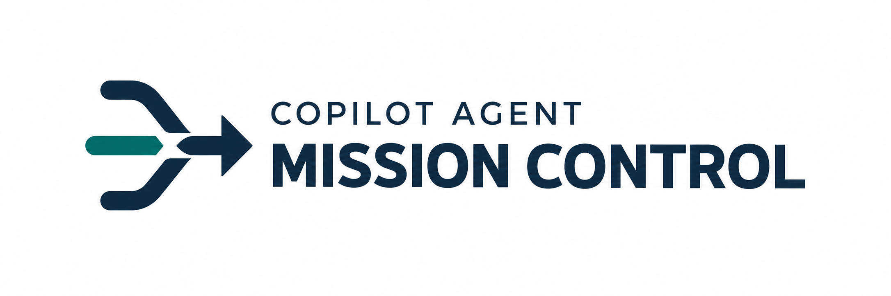
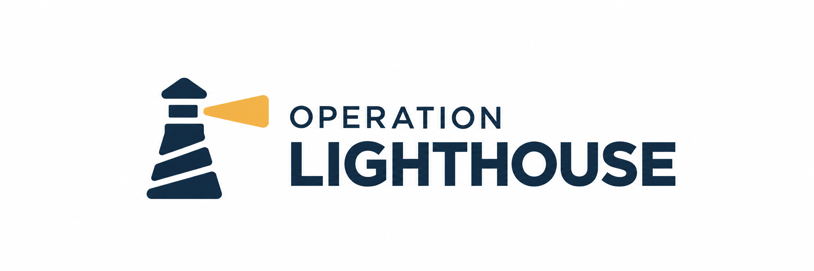
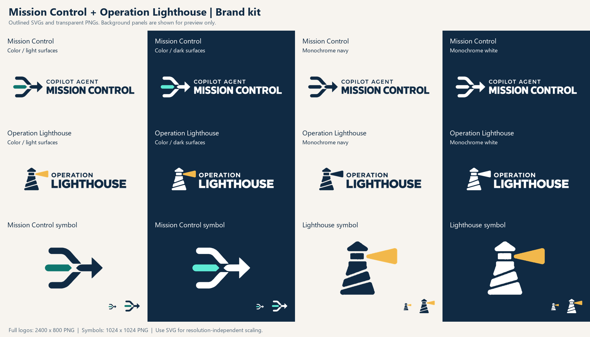

# Copilot Agent Mission Control - Visual identity

Status: **stages A-H produced; outlined SVG and transparent PNG kit available**  
Scope: **platform identity and Operation Lighthouse campaign identity**  
Guide and production-prompt language: **English**

This guide defines the selected visual direction, production requirements and
copy-ready prompts for the brand assets. It does not change the application's
current theme or replace campaign media manifests.

The two initial selected ChatGPT images remain unchanged in `references/`.
Those concept references are 2172 x 724 RGB PNGs with opaque backgrounds.

Use **`exports/` for new materials**. It contains 12 outlined SVGs and 12
transparent PNGs rendered from those vectors, with the specified flat colors.

The four supplied light/dark PNGs remain unchanged in `assets/`, alongside the
earlier symbol crops and direct monochrome conversions. These working raster
assets retain the supplied color and opacity variations; they are preserved
for comparison rather than replaced by the production exports.

## 1. Brand family

Copilot Agent Mission Control is a mission-based workshop platform for building
GitHub Copilot agents. Operation Lighthouse is its first campaign, not the name
of the entire platform.

| Brand | Role | Visual idea |
| --- | --- | --- |
| Copilot Agent Mission Control | Platform and overall training experience | Signals converge into coordinated action |
| Operation Lighthouse | Coastal emergency-response campaign | A lighthouse provides guidance through uncertainty |

Use the platform logo on the application, general workshop materials and
cross-campaign documentation. Use the campaign logo on the opening film,
campaign materials, mission briefings and finale. When both appear, establish
one clear primary identity rather than making two equally dominant logos.

The identity should feel capable, collaborative and human-controlled. Avoid
military insignia, space-agency imitation, generic robot imagery and decorative
neon circuitry. Do not imply that these are official GitHub product logos.

Optional supporting copy, kept outside the logos:

- Platform: **Build agents. Coordinate action.**
- Campaign: **Evidence before action.**

## 2. Selected designs

Preserve these designs. Production cleanup must not become another redesign.

### Platform



- Two navy branches and a teal input converge toward a navy outgoing arrow.
- Preserve the central negative spaces and the approved relationship between
  curved and angular shapes.
- Upper line: `COPILOT AGENT`.
- Primary line: `MISSION CONTROL`.

### Campaign



- A simplified navy lighthouse with diagonal negative spaces and an amber beam.
- Preserve the roof, lantern, tower segments and beam geometry.
- Upper line: `OPERATION`.
- Primary line: `LIGHTHOUSE`.

Both designs use a small, widely spaced upper line above a bold primary name.
Keep that hierarchy, icon-to-wordmark relationship and overall proportions.

## 3. Color system

The following are target production colors, not a claim that every pixel in
the generated references already matches these values.

| Token | HEX | Role |
| --- | --- | --- |
| Control Navy | `#102A43` | Main logo structure, primary text, dark title backgrounds |
| Signal Teal | `#0F766E` | Platform accent on light backgrounds |
| Signal Teal Light | `#5EEAD4` | Platform accent in the dark-background logo variant |
| Beacon Amber | `#F2B84B` | Campaign beacon and restrained campaign highlights |
| Warm Paper | `#F7F4EF` | Light content backgrounds; matches the existing app background token |
| Operational Slate | `#526779` | Secondary text on light backgrounds |
| White | `#FFFFFF` | Reversed logo artwork and light foregrounds on dark backgrounds |

### Approved logo combinations

| Version | Platform | Campaign | Intended surface |
| --- | --- | --- | --- |
| Color, light-surface | Navy + Signal Teal | Navy + Beacon Amber | White or Warm Paper |
| Color, dark-surface | White + Signal Teal Light | White + Beacon Amber | Control Navy |
| Monochrome navy | All visible artwork in Navy | All visible artwork in Navy | Light surfaces |
| Monochrome white | All visible artwork in White | All visible artwork in White | Dark surfaces |

**The intended surface is not part of the exported logo.** Every PNG logo
variant must have a transparent background, including the dark-surface version.

Use navy text on amber rather than white text on amber. Avoid amber body text
on light backgrounds. Reserve red for actual alerts outside the core logo
palette, and pair status colors with labels or shapes.

## 4. Typography

The generated logo lettering is selected artwork. It has **not** been verified
as a specific font. Do not silently substitute IBM Plex Sans or another font
while cleaning up the logo.

The current SVG masters trace the selected letterforms into editable paths.
They contain no live text or embedded raster lettering and require no installed
logo font. A future typesetting replacement still requires explicit approval.

For surrounding workshop materials:

- **IBM Plex Sans:** headings and body text; use semibold for headings.
- **IBM Plex Mono:** code, mission identifiers and technical labels.
- **Aptos:** temporary document fallback when the preferred fonts are unavailable.

Typeset presentation text as real text, not as part of generated images. For
projected workshop slides, prefer body text of at least 24 pt and avoid dense
paragraphs. Keep labels and diagrams readable from the back of the room.

## 5. Placement and usage

### Clear space and size

Define `x` as the capital-letter height of the logo's smaller upper line.
Leave at least `x` of clear space around the complete lockup. Measure from the
visible artwork, not from the original image's large white canvas.

For a symbol-only asset, leave at least one dominant stroke-width of clear
space around the symbol.

Use 320 CSS pixels as an initial review threshold for the platform's horizontal
lockup and 240 CSS pixels for the campaign lockup. These are starting points,
not validated guarantees: check the small upper line at the actual display size.
Use the symbol alone when the full name becomes hard to read.

Review symbols at 32 px and 64 px. A 16 px favicon may need a separately reviewed
optical simplification; do not force an unreadable full logo into that size.

### Backgrounds

- Use the navy variants on White or Warm Paper.
- Use reversed variants on Control Navy.
- Do not place a logo over busy footage without a quiet area or a separately
  composed background panel.
- Keep panels separate from the transparent logo file.

### Do not

- Stretch, rotate or skew the logos.
- Change icon and wordmark proportions independently.
- Add shadows, gradients, textures, glow, bevels or outlines.
- Fill intentional gaps or letter counters.
- Rearrange or remove letters.
- Put either logo inside an unrelated badge or shield.
- Recolor a logo to indicate mission success or failure.
- Translate the proper brand names between campaign locales.

## 6. Application direction

- **Opening and closing screens:** Control Navy, restrained accent color and
  the appropriate reversed logo.
- **Instructional slides:** Warm Paper, navy headings and readable dark text.
- **Technical diagrams:** clean paths and nodes, limited accents and explicit
  labels; not decorative circuit boards.
- **Campaign photography:** realistic people, stormy slate-blue exterior light
  and warm amber practical light.
- **Video:** compose critical titles and captions separately so spelling,
  timing and accessibility remain controllable.
- **Application:** apply any future theme changes as a separate implementation;
  this document does not modify existing CSS or semantic status colors.

## 7. Production asset requirements

### PNG means real transparency

A PNG extension alone is not enough. Production logo PNGs must:

- Be RGBA images with an actual alpha channel.
- Have transparent canvas pixels, not a white rectangle.
- Preserve transparency in the spaces between shapes and inside letters.
- Keep the logo's colored or white foreground opaque, with clean antialiased
  edges.
- Have no baked-in checkerboard, paper texture, shadows or white edge halos.
- Use the sRGB color space.

An image viewer's checkerboard is only a preview convention. A checkerboard
painted into the image is not transparency.

Inspect exports on white, navy and a contrasting background. Do not rely on
the generating tool's statement that the file is transparent.

### SVG means actual vector geometry

The SVG files in `exports/` contain genuine vector paths. A PNG embedded inside
an SVG container would still be raster artwork and is not an acceptable master.

Final SVGs must contain editable paths/shapes, preserve the approved geometry
and spacing, and contain no embedded PNG/JPEG or base64 raster data. Outline
the wordmark in the final distribution master to avoid font substitution.
Keep an editable design source when typesetting is used.

Do not relabel an image-generation output as SVG or claim it has been
vectorized simply because it has crisp edges.

### Export sizes

- Production horizontal PNGs: 2400 x 800, rendered from the SVG masters.
- Production symbol PNGs: 1024 x 1024, rendered from the SVG masters.
- The four supplied PNGs remain unchanged at 2172 x 724 in `assets/`.
- The older symbol crops in `assets/` are resampled raster derivatives; they
  are not the source of the new vector masters.
- Export smaller application sizes from the vector master as needed.
- Image-generation tools may not honor exact dimensions. Request their highest
  useful native resolution; standardize exact export sizes after mastering.
- Do not upscale a small raster and describe it as a high-detail vector master.

### Available files

- `references/`: the two original selected concept images, kept unchanged.
- `assets/`: supplied PNGs, earlier symbol crops and direct monochrome conversions.
- `exports/`: the recommended kit, containing 12 SVG/PNG pairs.
- `brand-kit-preview.png`: an overview, not a transparent logo asset.



| Brand | Intended surface | Full logo | Symbol only |
| --- | --- | --- | --- |
| Mission Control | Light | [PNG](exports/mission-control-logo-color-light.png) / [SVG](exports/mission-control-logo-color-light.svg) | [PNG](exports/mission-control-symbol-color-light.png) / [SVG](exports/mission-control-symbol-color-light.svg) |
| Mission Control | Dark | [PNG](exports/mission-control-logo-color-dark.png) / [SVG](exports/mission-control-logo-color-dark.svg) | [PNG](exports/mission-control-symbol-color-dark.png) / [SVG](exports/mission-control-symbol-color-dark.svg) |
| Operation Lighthouse | Light | [PNG](exports/operation-lighthouse-logo-color-light.png) / [SVG](exports/operation-lighthouse-logo-color-light.svg) | [PNG](exports/operation-lighthouse-symbol-color-light.png) / [SVG](exports/operation-lighthouse-symbol-color-light.svg) |
| Operation Lighthouse | Dark | [PNG](exports/operation-lighthouse-logo-color-dark.png) / [SVG](exports/operation-lighthouse-logo-color-dark.svg) | [PNG](exports/operation-lighthouse-symbol-color-dark.png) / [SVG](exports/operation-lighthouse-symbol-color-dark.svg) |

`light` and `dark` describe the intended display surface, not a background
included in the file. All production logo and symbol files are transparent.

### Monochrome logos

| Brand | Navy | White |
| --- | --- | --- |
| Mission Control | [PNG](exports/mission-control-logo-mono-navy.png) / [SVG](exports/mission-control-logo-mono-navy.svg) | [PNG](exports/mission-control-logo-mono-white.png) / [SVG](exports/mission-control-logo-mono-white.svg) |
| Operation Lighthouse | [PNG](exports/operation-lighthouse-logo-mono-navy.png) / [SVG](exports/operation-lighthouse-logo-mono-navy.svg) | [PNG](exports/operation-lighthouse-logo-mono-white.png) / [SVG](exports/operation-lighthouse-logo-mono-white.svg) |

### Completed stages

| Stage | Deliverable | Status |
| --- | --- | --- |
| A/B | Full-color logos for light surfaces | Available |
| C/D | Reversed logos for dark surfaces | Available |
| E | Symbols without wordmarks | Available |
| F | Monochrome navy logos | Available |
| G | Monochrome white logos | Available |
| H | Outlined SVG masters and standardized PNG derivatives | Available |

## 8. Recommended production order

**The current logo-production stages A-H have been completed.** Use the files
in `exports/`; do not repeat image-generation prompts to reproduce them.

Each brand's production variants share the same traced geometry. Dark and
monochrome versions are color changes only, eliminating the small shape
differences between independently generated light/dark source images.

For a future logo revision, follow this sequence:

1. Attach the selected platform image and use prompt A.
2. Attach the selected campaign image and use prompt B.
3. Compare both cleaned logos against the selected designs.
4. Verify actual transparency, lettering, geometry and colors.
5. Prepare accurate vector masters.
6. Derive dark, symbol-only and monochrome exports from those masters.

The first generation round needs only **two cleaned logos**, not twelve
independent reinterpretations.

Prompts C-G are available if an image tool is used for variants, but deterministic
cropping and recoloring of an approved transparent/vector master is preferable.
Always attach the latest approved master, not a screenshot of it on a slide.

If the tool still returns an opaque PNG, keep the approved artwork and remove
the background with an appropriate image editor. Do not keep redesigning the
logo to solve a transparency-export problem.

## 9. Copy-ready production prompts

These prompts can be used with ChatGPT image editing or Nano Banana. Attach the
specified image before sending each prompt. Request one asset per generation,
not a contact sheet or a brand presentation board.

### A. Platform: clean, full-color transparent PNG

Attach `references/mission-control-approved.png`.

```text
Use the attached approved Copilot Agent Mission Control logo as the exact
design reference. This is production cleanup, not a redesign.

Preserve the symbol geometry, central negative spaces, arrow shape,
letterforms, spelling, kerning, line spacing and icon-to-wordmark proportions.
Do not add nodes, join existing gaps or substitute a different typeface.

Keep the exact text:
COPILOT AGENT
MISSION CONTROL

Replace the shaded artwork with flat, solid colors:
- Navy #102A43 for the main symbol and all lettering.
- Teal #0F766E for the existing central incoming path only.

Remove the entire background and all paper texture, shading, gradients,
shadows and edge halos. Background areas and intentional negative spaces
must be genuinely transparent.

Return one high-resolution PNG with a real alpha channel.
Keep the logo artwork opaque with clean antialiased edges.
Leave clear space around the complete logo without excessive empty canvas.

No white background, no painted checkerboard, no mockup, no additional text,
no border and no alternative designs.
```

### B. Campaign: clean, full-color transparent PNG

Attach `references/operation-lighthouse-approved.png`.

```text
Use the attached approved Operation Lighthouse logo as the exact design
reference. This is production cleanup, not a redesign.

Preserve the lighthouse roof, lantern, tower segments, diagonal negative
spaces, beam shape, letterforms, spelling, kerning, line spacing and
icon-to-wordmark proportions. Do not redraw the lighthouse or substitute
a different typeface.

Keep the exact text:
OPERATION
LIGHTHOUSE

Replace the shaded artwork with flat, solid colors:
- Navy #102A43 for the lighthouse and all lettering.
- Amber #F2B84B for the existing light beam only.

Remove the entire background and all paper texture, shading, gradients,
shadows and edge halos. Background areas and intentional negative spaces
must be genuinely transparent.

Return one high-resolution PNG with a real alpha channel.
Keep the logo artwork opaque with clean antialiased edges.
Leave clear space around the complete logo without excessive empty canvas.

No white background, no painted checkerboard, no mockup, no additional text,
no border and no alternative designs.
```

### C. Platform: transparent version for dark surfaces

Attach the approved output of prompt A.

```text
Create a dark-surface color variant of this approved transparent logo.
Change colors only; preserve every shape, letter, gap, proportion and position.

Replace navy #102A43 with solid white #FFFFFF.
Replace the teal accent with light teal #5EEAD4.

Keep the canvas and all intentional negative spaces fully transparent.
The white logo artwork must remain opaque. Do not add a dark background.

Return one PNG with a real alpha channel and clean antialiased edges.
No redesign, added outline, shadow, glow, texture or preview mockup.
```

### D. Campaign: transparent version for dark surfaces

Attach the approved output of prompt B.

```text
Create a dark-surface color variant of this approved transparent logo.
Change colors only; preserve every shape, letter, gap, proportion and position.

Replace navy #102A43 with solid white #FFFFFF.
Keep the existing beam in amber #F2B84B.

Keep the canvas and all intentional negative spaces fully transparent.
The white logo artwork must remain opaque. Do not add a dark background.

Return one PNG with a real alpha channel and clean antialiased edges.
No redesign, added outline, shadow, glow, texture or preview mockup.
```

### E. Symbol only

**Already completed for all four current variants.**
Use the `*-symbol-color-light.png` and `*-symbol-color-dark.png` files in
`exports/`, or their SVG counterparts. The earlier direct crops remain in
`assets/`; there is no need to run this prompt again.

For a future variant, prefer a direct crop of its approved transparent full
logo. The prompt below is an optional image-tool fallback, used separately for
each brand and color variant.

```text
Extract only the existing symbol from this approved logo.
Remove the wordmark entirely without redrawing or changing the symbol.

Preserve all existing colors, shapes, proportions and negative spaces.
Center the symbol on a square transparent canvas with balanced clear space.
Do not place it inside a new square, circle, badge or border.

Return one high-resolution PNG with a real alpha channel.
Keep the symbol opaque, with clean antialiased edges.
No background, checkerboard, text, shadow, glow or new design elements.
```

### F. Monochrome navy

**Completed for both brands.** Use the `*-logo-mono-navy.png` or `.svg` files
in `exports/`. The prompt below is retained for future revisions, not required
for the existing kit.

```text
Create a single-color version of this approved transparent logo.
Recolor every existing foreground shape and letter to solid navy #102A43,
including the original accent-colored area.

Preserve all geometry, spelling, spacing, proportions and intentional gaps.
Keep the background and negative spaces transparent.

Return one PNG with a real alpha channel and clean antialiased edges.
No background, gradients, shading, outlines or redesign.
```

### G. Monochrome white

**Completed for both brands.** Use the `*-logo-mono-white.png` or `.svg` files
in `exports/`. The prompt below is retained for future revisions, not required
for the existing kit.

```text
Create a single-color version of this approved transparent logo.
Recolor every existing foreground shape and letter to solid white #FFFFFF,
including the original accent-colored area.

Preserve all geometry, spelling, spacing, proportions and intentional gaps.
Keep the white artwork opaque and the background and negative spaces
transparent. Do not add a navy or black background for visibility.

Return one PNG with a real alpha channel and clean antialiased edges.
No gradients, shading, outlines, glow or redesign.
```

### H. Vector-master production brief

**Completed through local vector tracing, not another image generation.**
The SVG files in `exports/` contain editable symbol and letter outlines.
The brief below is retained for future vector revisions. The mastering method
and its limits are recorded in section 11.

```text
Reconstruct the attached approved logo as a genuine editable SVG.
Preserve its selected symbol, letterforms, spacing, proportions and
intentional negative spaces. This is faithful vector mastering, not redesign.

Use clean paths and economical geometry with the approved solid brand colors.
Do not embed, link or base64-encode the raster image inside the SVG.
Keep the background transparent.

Preserve the wordmark as accurate outlined vector shapes in the distribution
master. If a font match is needed, obtain approval before changing letterforms.

Provide the complete logo and its symbol-only counterpart, with a correct
viewBox and consistent clear space. Check both light and dark surfaces and
small-size legibility before exporting PNG derivatives.
```

## 10. Production review

The following checks apply to `exports/`, not to the unchanged source images.

- [x] Correct brand name and exact spelling.
- [x] Selected symbols and lettering retained without a new generative design.
- [x] Flat colors match the specified variant.
- [x] RGBA PNGs have genuinely transparent background pixels.
- [x] Negative spaces and letter counters remain open.
- [x] No added matte, checkerboard, shading, shadow or edge halo.
- [x] Dark-surface and monochrome-white interiors are opaque.
- [x] Clear space and aspect ratio are preserved.
- [x] Symbol variants are reviewed at 32 px and 64 px.
- [x] SVGs contain actual paths, not embedded raster artwork or live fonts.
- [x] Files are named by brand, asset type and variant.

Check legibility again at the actual placement size in each presentation or
video. A new application, very small icon or large-format print may need its
own optical review; these files are not a substitute for that application check.

## 11. Reference provenance

### Initial concept references

These are copies of the two initial user-selected ChatGPT image outputs.
Preserve them unchanged so future production assets can be compared with the
chosen designs. The references themselves are not transparent or vector files.

| Reference | Dimensions | Source format | SHA-256 |
| --- | --- | --- | --- |
| `references/mission-control-approved.png` | 2172 x 724 | PNG, RGB, opaque | `0435077a8402450046d70fbc75f31197fbf104f84fbffbd6c24b7d4ee2c23cb6` |
| `references/operation-lighthouse-approved.png` | 2172 x 724 | PNG, RGB, opaque | `2172ecace14b2f40e66ddf1546368f95e88f0fa79f37049336350675a025dc73` |

### Supplied transparent variants

The following files were renamed and moved from `references/` to `assets/`.
Their contents are unchanged from the supplied files.

| Asset in `assets/` | Supplied filename | SHA-256 |
| --- | --- | --- |
| `mission-control-logo-color-light.png` | `ChatGPT Image Sep 28, 2026, 06_31_12 PM.png` | `a3b4ec2c9cd5eba9c0a843e068648ccdebedbeaffd7c364c2f008ea41ced50ed` |
| `mission-control-logo-color-dark.png` | `ChatGPT Image Sep 28, 2026, 06_45_02 PM.png` | `23b3d16cbb27a4e80cebc206217ff4e5b24857b59e211be4f2878bc7cf31b0fe` |
| `operation-lighthouse-logo-color-light.png` | `ChatGPT Image Sep 28, 2026, 06_32_32 PM.png` | `0d574a9e4f5ae30b3646e84f34dff8b17eb6aa632970d7ee606fd805a1deb14f` |
| `operation-lighthouse-logo-color-dark.png` | `ChatGPT Image Sep 28, 2026, 06_46_08 PM.png` | `19fcdc3ccf303eddd76f58db53682785ea4d51051cbfb70d0a41c27c6e794aec` |

### Earlier raster symbol extraction

Each symbol was cropped from its matching full logo, given transparent
padding, and resampled once with Lanczos filtering onto a 1024 x 1024 canvas.
No generative redraw or recoloring was applied. Color, opacity and small
geometric differences between the supplied variants are inherited.

The crop excludes the wordmark. Its bounds include an eight-pixel margin
around symbol pixels with alpha of at least 8/255, retaining the antialiased
edges without centering on distant, nearly invisible generation specks.
The alpha threshold is used only to locate the crop, not to change its pixels.

Crop rectangles below use source pixels in `(left, top, right, bottom)` order,
with exclusive right and bottom bounds.

| Source logo | Crop rectangle |
| --- | --- |
| `mission-control-logo-color-light.png` | `(122, 185, 605, 533)` |
| `mission-control-logo-color-dark.png` | `(121, 182, 604, 534)` |
| `operation-lighthouse-logo-color-light.png` | `(295, 174, 695, 548)` |
| `operation-lighthouse-logo-color-dark.png` | `(294, 171, 697, 550)` |

### Direct monochrome conversions

The four `*-logo-mono-*.png` files in `assets/` recolor the corresponding
light-surface source while preserving its alpha channel pixel for pixel.
They remain at 2172 x 724. The recommended monochrome files in `exports/`
are instead rendered from the outlined vectors with opaque interiors.

### Vector mastering and production exports

The geometry source for each brand is its supplied
`assets/{brand}-logo-color-light.png`. All six production variants per brand
are derived from that same geometry rather than independently traced from
different generations.

The local mastering process:

1. Smooth the source alpha lightly with a 0.6 px Gaussian radius and extract
   the foreground at alpha 128/255.
2. Separate the existing accent component from the primary symbol and lettering.
3. Trace the masks with ImageTracerJS 1.2.6: `ltres=0.5`, `qtres=0.5`,
   `pathomit=8`, `rightangleenhance=false`, no stroke or image blur, and a fixed
   two-color tracing palette.
4. Preserve letter counters and intentional gaps as outlined paths. Round
   coordinates to three decimal places, with no font substitution.
5. Apply the colors in section 3 and derive light, dark, symbol and monochrome
   variants from identical paths.
6. Render the final transparent PNGs from the SVGs with resvg 2.6.2.

The resulting files contain only SVG roots, metadata titles, groups and paths.
There are no embedded PNGs, external images, live text, gradients or filters.
The full platform logo has 30 paths and its symbol has four; the campaign logo
has 25 paths and its symbol has six.

These are raster-derived vector outlines, not a newly typeset wordmark or a
manual reconstruction of mathematically ideal geometry. Small irregularities
in the supplied design can remain. Any later geometric redesign or font
replacement should be reviewed separately rather than silently changing the
selected identity.
